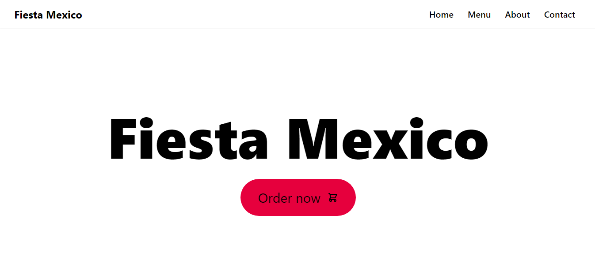

<h1 align="center">A simplified food app built with React</h1>

Auto formatted with Prettier

<h3 align="center">
  <a href="https://reactfood-app.netlify.app/">Visit the live app</a>
</h3>

## Setting up development environment 🛠

- `git clone https://github.com/s-almas786/food_app.git`
- `npm install`
- `cd food_app && npm start` in another terminal tab
- App should now be running on `http://localhost:3000/`

## Contributing

I will not be accepting PR's on this repository. Feel free to fork and maintain your own version.

<h3>
  <a href="https://reactfood-app.netlify.app/">Visit the live app</a>
</h3>
